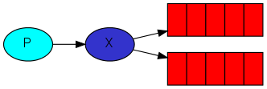
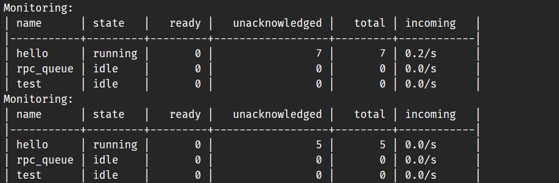
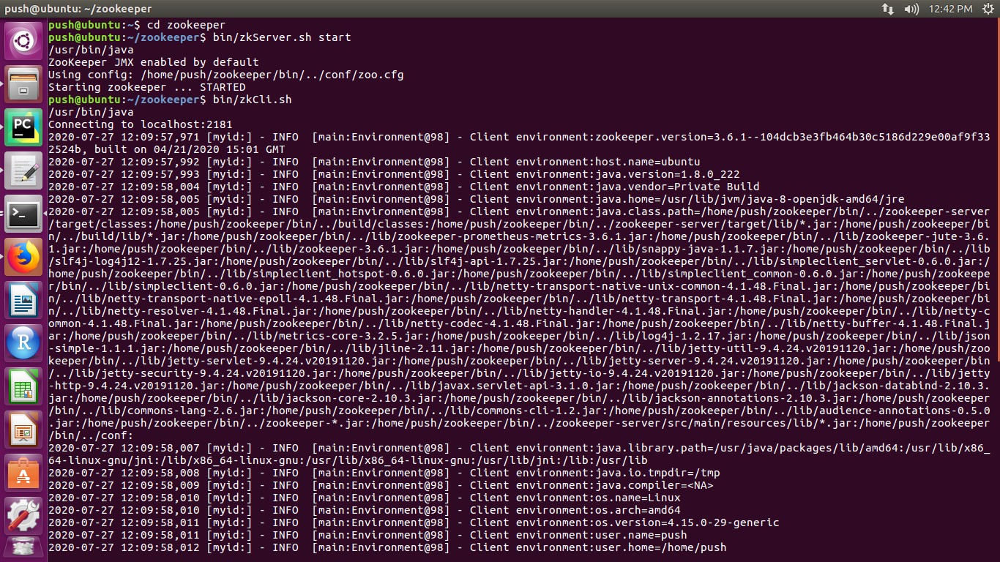
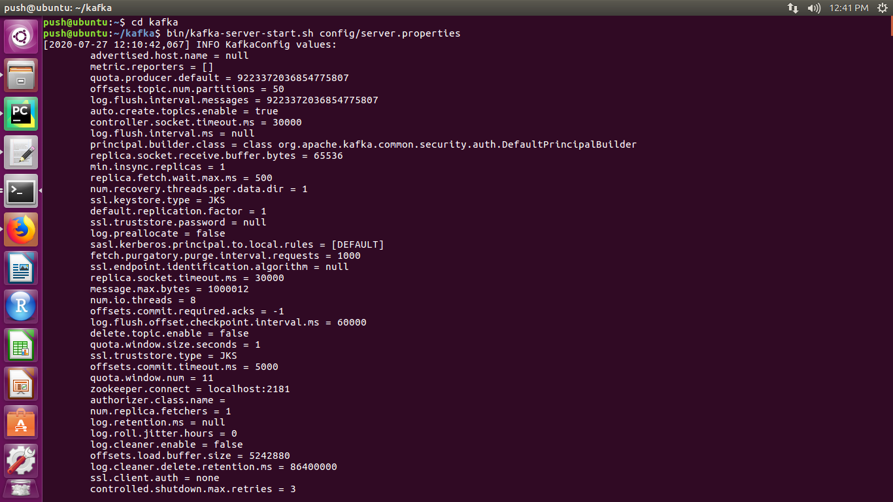
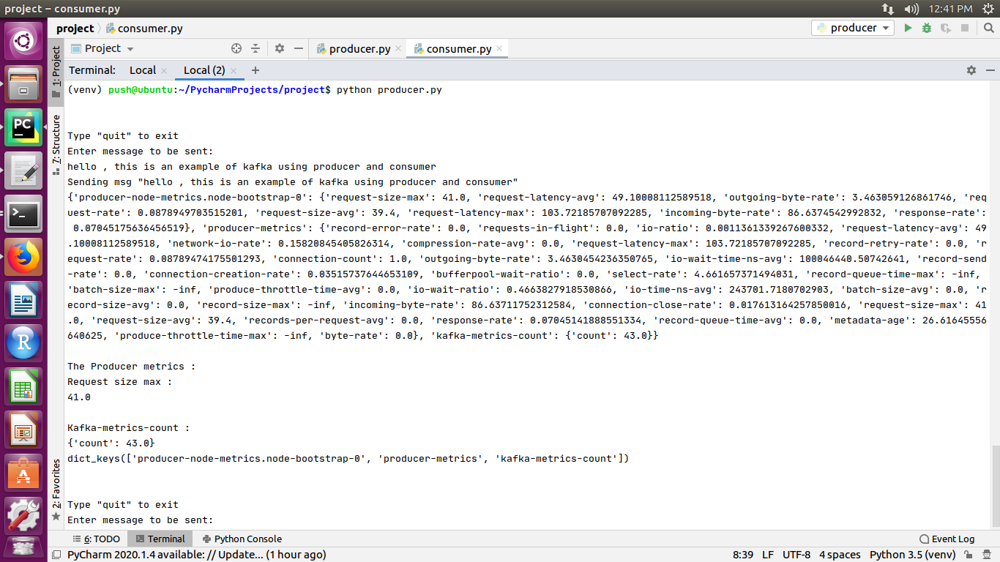
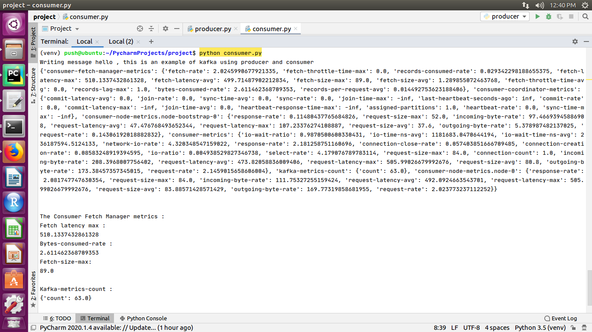
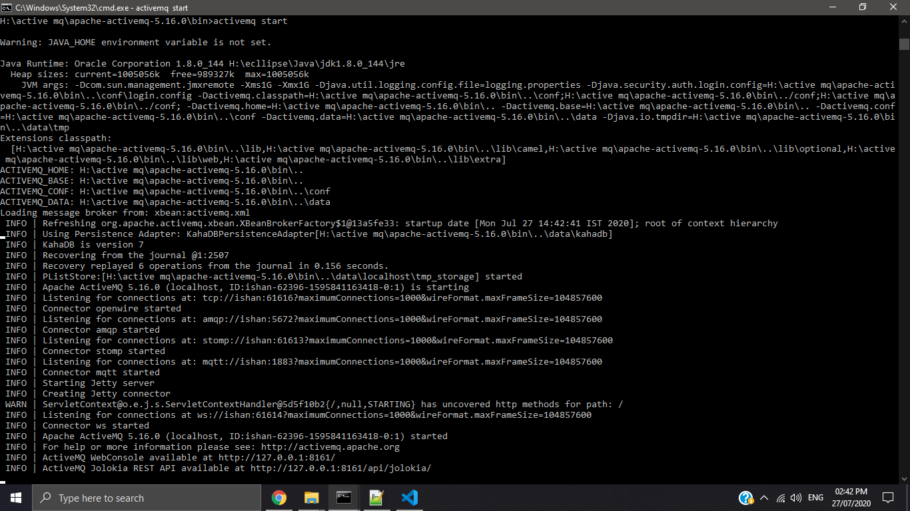
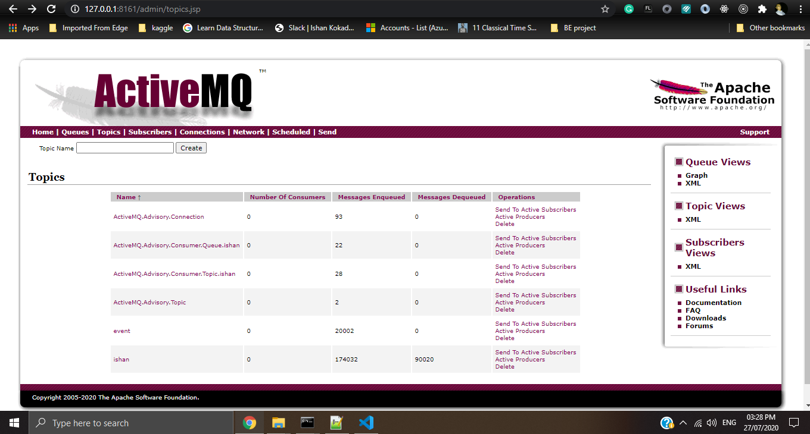

# message-queues-in-python

Table of Contents
-----------------

- [What are Message Queues](#What-are-Message-Queues)
- Different Message Queues:
    + [RabbitMQ](#RabbitMQ)
    + [Kafka](#Kafka)
    + [ActiveMQ](#ActiveMQ)


What are Message Queues
--------

Message queuing allows applications to communicate by sending messages to each other.The message queue provides temporary message storage when the destination program is busy or not connected.


The basic architecture of a message queue is simple; there are **client** applications called **producers** that create messages and deliver them to the message **queue**. Another application, called a **consumer**, connects to the queue and gets the messages to be processed. Messages placed onto the queue are stored until the consumer retrieves them.

A message queue provides an **asynchronous communications protocol**, which is a system that puts a message onto a message queue and does not require an immediate response to continuing processing. **Email** is probably the best example of asynchronous communication. When an email is sent, the sender continues to process other things without needing an immediate response from the receiver. This way of handling messages **decouples** the producer from the consumer so that they do not need to interact with the message queue at the same time.


[RabbitMQ](https://www.rabbitmq.com/)
--------

RabbitMQ is a message broker: it accepts and forwards messages.

RabbitMQ, and messaging in general, uses some jargon.

- **Producing** means nothing more than sending. A program that sends messages is a **producer** 
- A **queue** is the name for a post box which lives inside RabbitMQ. Although messages flow through RabbitMQ and your applications, they can only be stored inside a queue. A queue is only bound by the host's memory & disk limits, it's essentially a large message buffer.
- **Consuming** has a similar meaning to receiving. A **consumer** is a program that mostly waits to receive messages

#### Quick start (using the Pika Python client):

[Install RabbitMQ](https://www.rabbitmq.com/download.html)

Install Pika - RabbitMQ Python Client:
```bash
python -m pip install pika --upgrade
```

#### Code

A producer (sender) that sends a single message, and a consumer (receiver) that receives messages and prints them out. It's a "Hello World" of messaging.

You can find the code [here](RabbitMQ-Code)

[Tutorial: "Hello World!"](https://www.rabbitmq.com/tutorial-one-python.html):
    
```bash
python send.py
python receive.py
```

#### RabbitMQ Features:

- **Round-robin dispatching**: [Tutorial](https://www.rabbitmq.com/tutorials/tutorial-two-python.html)
    + By default, RabbitMQ will send each message to the next consumer, in sequence. On average every consumer will get the same number of messages. This way of distributing messages is called round-robin. 
    + This helps is easily parallelise work. If we are building up a backlog of work, we can just add more consumers and that way, scale easily.

- **Message acknowledgement**: [Tutorial](https://www.rabbitmq.com/tutorials/tutorial-two-python.html)
    + An **ack(nowledgement)** is sent back by the consumer to tell RabbitMQ that a particular message had been received, processed and that RabbitMQ is free to delete it.
    + If a consumer dies without sending an ack, RabbitMQ will re-queue it. If there are other consumers online at the same time, it will then quickly redeliver it to another consumer. 

- **Message Durability**: [Tutorial](https://www.rabbitmq.com/tutorials/tutorial-two-python.html)
    + we can mark both the queue and messages as durable.

- **Fair dispatch**: [Tutorial](https://www.rabbitmq.com/tutorials/tutorial-two-python.html)
    + In a situation with two workers, when all odd messages are heavy and even messages are light, one worker will be constantly busy and the other one will do hardly any work. 
    + In order to defeat RabbitMQ allows us to use the `Channel#basic_qos` channel method with the `prefetch_count=1` setting. This uses the `basic.qos` protocol method to tell RabbitMQ not to give more than one message to a worker at a time

- **Exchanges**:
    + The core idea in the messaging model in RabbitMQ is that the producer never sends any messages directly to a queue.
    + Instead, the producer can only send messages to an exchange.
    + An exchange receives messages from producers and the other side it pushes the to the queue.
    
    
    + Here X is an exchange
    + It allows us to send message to multiple consumers
    
    + Types:
        * fanout - it broadcast all the messages it receives to all the queues [Tutorial](https://www.rabbitmq.com/tutorials/tutorial-three-python.html)
        * direct - send message to a particular queue [Tutorial](https://www.rabbitmq.com/tutorials/tutorial-four-python.html)
        * topic - send message to all the queues which matches the topic [Tutorial](https://www.rabbitmq.com/tutorials/tutorial-five-python.html)

### Monitoring

- Run [rabbitmq-monitoring.py](RabbitMQ-Code/rabbitmq-monitoring.py)
```bash
python rabbitmq-monitoring.py
```
- The default username/password is guest/guest
- Monitoring is performed by accessing RabbitMQ's HTTP API
- Output Example:



- It displays:
    + Overview: queue name and state(idle/running)
    + No.of messages : ready, unacknowledged and total
    + Rate: incoming/publish
- Every 5 seconds the monitoring output is updated

[KAFKA](https://kafka.apache.org/)


**INTRODUCTION**

**Apache Kafka** is a distributed streaming platform.

A streaming platform has **three key capabilities ** :

1.	Publish and subscribe to streams of records, similar to a message queue or enterprise messaging system.
2.	Store streams of records in a fault-tolerant durable way.
3.	Process streams of records as they occur.

Kafka runs as a cluster on one or more servers that can span multiple datacenters.The Kafka cluster stores streams of records in categories called topics.Each record consists of a key, a value, and a timestamp.

Kafka is generally used for two broad classes of applications:

1.	Building real-time streaming data pipelines that reliably get data between systems or applications.
2.	Building real-time streaming applications that transform or react to the streams of data.

Kafka has **five core APIs **:

1.	The [Producer API](https://kafka.apache.org/documentation/#api) allows an application to publish a stream of records to one or more Kafka topics.
2.	The [Consumer API](https://kafka.apache.org/documentation/#api) allows an application to subscribe to one or more topics and process the stream of records produced to them.
3.	The [Streams API](https://kafka.apache.org/documentation/#api) allows an application to act as a stream processor, consuming an input stream from one or more topics and producing an output stream to one or more output topics, effectively transforming the input streams to output streams.
4.	The [Connector API](https://kafka.apache.org/documentation/#api) allows building and running reusable producers or consumers that connect Kafka topics to existing applications or data systems. For example, a connector to a relational database might capture every change to a table.
5.	The [Admin API](https://kafka.apache.org/documentation/#api) allows managing and inspecting topics, brokers and other Kafka objects.

In Kafka the communication between the clients and the servers is done with a simple, high-performance, language agnostic TCP protocol. This protocol is versioned and maintains backwards compatibility with older versions.


**INSTALLATION STEPS :**

[Installation]()

1. **Verifying Java Installation**
	java –version

2. **Install Zookeeper Framework**
To [install ZooKeeper](http://zookeeper.apache.org/releases.html) framework on your machine, visit the following link and download the latest version of ZooKeeper.

As of now, latest version of ZooKeeper is 3.4.6 (ZooKeeper-3.4.6.tar.gz).
Open terminal on ubuntu :
```bash
tar -zxf zookeeper-3.4.6.tar.gz
cd zookeeper-3.4.6
```


3.**Install Apache Kafka** 
Visit the official and download the latest version and then extract it on terminal 

tar -zxf kafka_2.11.0.9.0.0 tar.gz
cd folder_name

 **START** 

1. New terminal

cd zookeeper

start zookeeper :
```bash
bin/zkServer.sh start
bin/zkCli.sh
```



To stop zookeeper :  bin/zkServer.sh stop

2. New terminal

cd kafka

Start kafka :
```bash
bin/kafka-server-start.sh config/server.properties
```



To stop kafka : 
```bash
bin/kafka-server-stop.sh config/server.properties
```

3.New terminal 

cd kafka

**CREATING A KAFKA TOPIC**
```bash
bin/kafka-topics.sh --create --zookeeper localhost:2181 --replication-factor 1   
--partitions 1 --topic Hello-Kafka
```


IF trying to send messages through terminal :

START PRODUCER TO SEND MESSAGES

```bash
bin/kafka-console-producer.sh --broker-list localhost:9092 --topic Hello-Kafka
//start typing messages on terminal
```
//type messages 


START CONSUMER TO RECEIVE MESSAGES
```bash
bin/kafka-console-consumer.sh --zookeeper localhost:2181 —topic Hello-Kafka 
--from-beginning
```

//you will see messages on this terminal

### WITH PYTHON CLIENT :

**Install Python-kafka** : 

```bash
pip install kafka- python
```

Keep apache kafka and zookeeper running in background
Run consumer.py and producer.py on the new terminals


#### Code

A producer (sender) that sends a  message, and a consumer (receiver) that receives messages and prints them out.

You can find the code [here](Kafka)

[Kafka-Python](https://kafka-python.readthedocs.io/en/master/apidoc/modules.html)
    
```bash
python consumer.py
python producer.py
```

#### Monitoring 

It can be done by metric function when called in the program.

[Prodcuer Metrics](https://kafka.apache.org/documentation/#producer_sender_monitoring): 



[Consumer Metrics](https://kafka.apache.org/documentation/#consumer_monitoring): 




[ACTIVEMQ](https://activemq.apache.org/)
--------

**INTRODUCTION**

**Apache ActiveMQ** is open source, multi-protocol, Java-based messaging server.It has 2 messaging broker servers named as ActiveMQ 5 Classic and ActiveMQ Artemis.
Here we have used ActiveMQ 5 Classic.

It is mostly used for send messages between different applications.It has own JMS-Api to send, receive,acknowledge for messsage between server and client.JMS provides Java based connectivity to server.For connectiing server with other languages diffrent protocols are used externally.

**Connectivity**
 ActiveMQ provides a wide range of connectivity options, including support for protocols such as HTTP/S, IP multicast, SSL, STOMP, TCP, UDP, XMPP, and more. Support for such a wide range of protocols equates to more flexibility. Many existing systems utilize a particular protocol and don’t have the option to change, so a messaging platform that supports many protocols lowers the barrier to adoption.

For Python Connectivity Stomp protocol is used to message and acknowledge server. 


**INSTALLATION STEPS :**

1.	**Installing ActiveMQ Server**

	1.	Download Apache ActiveMQ Classic from [here](https://activemq.apache.org/components/classic/download/).
	2.	Open command prompt in C:\Program Files\active mq\apache-activemq-5.16.0\bin
	3.	Run this command to start server
		```bash
		activemq start
		```
		
		
		
3. 	**Installing Client Connectivity protocol Library stomp.py**
	```bash
		pip install stomp.py
	```


#### Code

A publisher (sender) that sends a  message, and a listner (receiver) that receives messages and prints them out.
At first run Listener and then run publisher in seperate command prompt. 

```bash
python publisher.py
python listener.py
```
### Monitoring 
For monitoring ActiveMQ server provides its own web application.It is started along with the message server at local host.
Here is snap of it.





**Difference between Kafka RabbitMQ ActiveMQ : **

REFERENCE::  https://stackshare.io/stackups/activemq-vs-kafka-vs-rabbitmq
